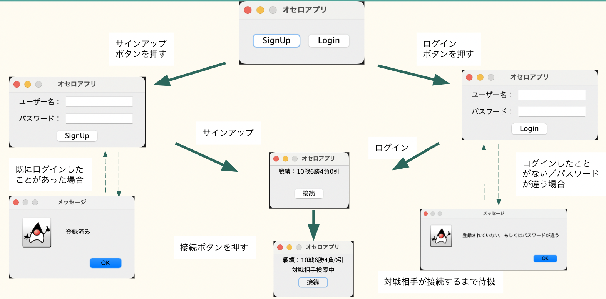

## サーバーの起動
```
java Server
```
## クライアントの起動
```
java Client
```
## ゲーム開始まで

## ゲーム開始
対戦相手が見つかったら以下のようになり，オセロができる。

## ゲーム終了
ゲームが終了するともう1度対戦するかアプリを終了するか選べる。

## 仕組み
1. サーバー起動  
 クライアントを受付する準備OK
2. クライアント起動  
サーバーはクライアントのアクセスを受け入れるとソケットを準備。さらにスレッドを作成してアクセスしたクライアントに割り当てる。これによって複数のクライアントをアクセス可能にした。
3. サインアップ  
ユーザ名とパスワードを受け付けるとcsvファイルに保存する。ユーザ名が既に存在していたら登録できない。
4. ログイン  
ユーザ名とパスワードを受け付けるとcsvファイルと照合し，一致すればログイン可能。
5. 対戦開始  
接続ボタンを押すと対戦相手を探す。待機がいれば開始し，いなければ自分が待機。待機はスレッドのwaitで実装。対戦するスレッド同士でオブジェクトを共通させることで，データをやり取りしている。
6. 対戦終了  
対戦が終了すると，戦績を更新し，csvファイルに保存する。またもう1度遊ぶかアプリを閉じるか選べる。